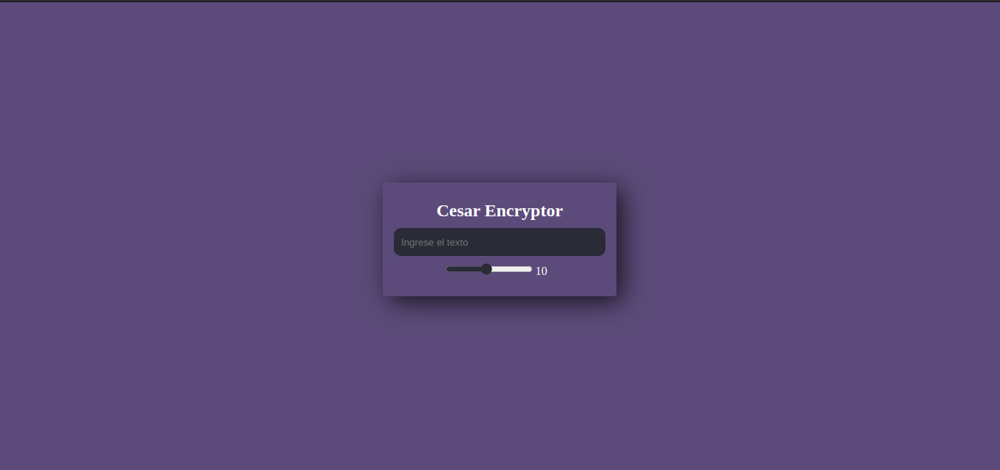

# 🔐 Cifrado César - Encryptor Web

Este es un proyecto de cifrado basado en el Cifrado César, un método de sustitución en el que cada letra del texto original se reemplaza por otra que se encuentra un número fijo de posiciones adelante en el alfabeto.

## 📌 Características:

- Interfaz sencilla e intuitiva.
- Cifrado dinámico con desplazamiento ajustable.
- Animación de letras antes de mostrar el resultado.
- Botón para copiar el texto cifrado al portapapeles.

## 🛠️ Tecnologías utilizadas:

- **HTML**: Estructura del proyecto.
- **CSS**: Estilos y diseño responsivo.
- **JavaScript**: Lógica de cifrado, animaciones y eventos.

## 📸 Capturas de Pantalla

